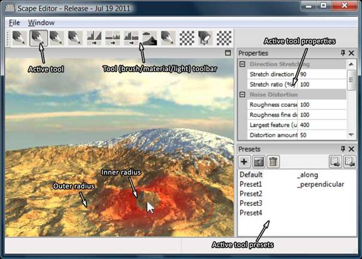
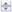

# User Guide - Scape

**Giliam de Carpentier** 
http://www.decarpentier.nl/scape 
June 9th, 2012

This document (very) briefly introduces Scape’s most important features
from a user’s perspective, providing the minimal set of know-how to
start experimenting with the Scape terrain editor.

## Running the application

Follow the following steps to run Scape. Obviously, only the last step
is needed every time. The other steps are needed only once.

  - Install a recent graphics driver for your specific hardware
  - Download and install the [Microsoft DirectX 9.0c
    runtime](http://www.microsoft.com/en-us/download/details.aspx?id=35)
  - Download and extract the Scape binary package to any folder, if not
    already done so. See <http://www.decarpentier.nl/scape> for details
    on how to do this.
  - Run `/Bin/Scape.exe` from this folder

## The UI Elements

The following image shows the different basic user interface elements

## Input

All menu items show their own keyboard shortcuts. True/false values in
the *Properties* pane can be toggled by double clicking on them. Number
properties can either be typed in, or dragged to (roughly) the right
value by vertically dragging the appropriate up/down widget:
.
The exact meaning of all these properties is very tool specific and will
not be described in this brief user manual.

The keyboard / mouse mapping used in the *3D View* is set through the
settings file `/Bin/Settings/ButtonDefinitions.xml`, making it possible
to fully customize the mapping using a text editor. By default, the
following mapping is provided:

### Navigation

  - Use the *W*, *A*, *S*, *D* keys to move around.
  - Press and hold the *RMB* (i.e. right mouse button), and drag to look
    around.
  - Press and hold *Ctrl-RMB* (the control key plus the *RMB*), and drag
    to pan while keeping the same 3D location under the mouse pointer.
  - Press and hold *Alt-RMB*, and drag to rotate around the 3D position
    that was under the mouse pointer when the drag started.
  - Press and hold *Ctrl-Alt-RMB*, and drag vertically to zoom from/to
    the 3D position that was under the mouse pointer when the drag
    started.

### Brushes

  - Press and hold the *LMB* (i.e. left mouse button), and drag to apply
    the primary effect of the active brush.
  - Press and hold *Ctrl*-*LMB*, and drag to apply the alternative (e.g.
    inverse) effect of the active brush, if available.
  - Press and hold *R* while dragging vertically to change the outer
    brush radius.
  - Press and hold *F* while dragging vertically to change the inner
    brush radius.
  - Press and hold *P* while dragging vertically to change the brush
    hardness / falloff shape.
  - Press *ESC* to cancel the current brush stroke’s application in
    progress.
  - Press *Ctrl-Z* to undo the last brush stroke.
  - Press *Ctrl-Shift-Z* to redo the last brush stroke.

*Note* There's currently no limit to the number of undo levels kept in
memory, making it possible to undo every step. The downside of this is
that Scape will eventually crash after all available memory has been
consumed to store the intermediate heightfield versions. So, for the
time being, safe your work often and restart regularly as a precaution.

### Lights

  - Press and hold *L* while dragging to change the sun’s direction.

## Terrain size and scale

Currently, Scape does not allow the user to change the terrain size and
scale from within a running instance of application. However, the
default parameters can be altered by editing
`/Bin/Settings/Startup.conf` and (re)starting Scape.

## Import/export

*Note:* Importing a heightfield image that has a different size than
Scape's current size will not affect the Scape's terrain size.
Consequently, importing smaller images will only load over only a part
of the full terrain, while importing larger images will result in a
clipped heightfield.

*Note:* There’s currently no way to create new flat terrains, other than
restarting the application, undoing all your previous editing (only in
the case you didn’t load a map before), or saving (once) and (re)loading
a ‘default’ flat map manually.

The following file formats and per-channel bit depths are supported for
both reading and writing:

<table border=1 cellspacing=0 cellpadding=0>
 <tr>
  <th>File format</th>
  <th>8-bit</th>
  <th>16-bit</th>
  <th>32-bit int</th>
  <th>32-bit float</th>
 </tr>
 <tr>
  <th>BMP</th>
  <td>+</td>
  <td>+&nbsp;1</td>
  <td>&nbsp;</td>
  <td>&nbsp;</td>
 </tr> 
 <tr>
  <th>PGM</th>
  <td>+</td>
  <td>+</td>
  <td>&nbsp;</td>
  <td>&nbsp;</td>
 </tr>
 <tr>
  <th>PNG</th>
  <td>+</td>
  <td>+</td>
  <td>&nbsp;</td>
  <td>&nbsp;</td>
 </tr>
 <tr>
  <th>TGA</th>
  <td>+</td>
  <td>&nbsp;</td>
  <td>&nbsp;</td>
  <td>&nbsp;</td>
 </tr>
 <tr>
  <th>TIFF</th>
  <td>+</td>
  <td>+</td>
  <td>+</td>
  <td>+</td>
 </tr>
 <tr>
  <th>RAW</th>
  <td>+</td>
  <td>+</td>
  <td>&nbsp;</td>
  <td>+</td>
 </tr> 
</table>

116-bit U3 BMP: 8-bit BMP using Unreal 3’s convention to
encode 16 bits

## License

See `/Docs/ScapeLicense.txt`

Copyright (c) 2007-2012, Giliam de Carpentier. All rights reserved.
